# 🛡️ Aegis Wallet: The AI-Powered Cross-Chain Guardian

[](https://aegis-wallet-zetachain.vercel.app/)
[](https://aegis-wallet-backend-zetachain.onrender.com/)
[](https://opensource.org/licenses/MIT)
[](https://www.zetachain.com/)
[](https://cloud.google.com/)

**Aegis Wallet is a full-stack dApp built for the ZetaChain x Google Cloud Buildathon.  
It acts as an intelligent smart contract vault that leverages the Google Gemini API to provide users with strategic analysis of their on-chain assets.**

---

## 🚀 Live Demo

This project is fully deployed and live. Try it now!

- **Frontend (Vercel):** [https://aegis-wallet-zetachain.vercel.app/](https://aegis-wallet-zetachain.vercel.app/)  
- **Backend API (Render):** [https://aegis-wallet-backend-zetachain.onrender.com/](https://aegis-wallet-backend-zetachain.onrender.com/)  

---

## 📽️ Demo Video & Screenshots

A brief walkthrough of the Aegis Wallet's core functionality.

*Insert a link to your 2–3 minute demo video here (YouTube link or GIF).*  

*Add a screenshot of your polished UI showing the portfolio and the AI analysis.*  

---

## ✨ Core Features

- **Smart Contract Vault**: A secure, on-chain vault on ZetaChain to hold and manage ZRC-20 tokens.  
- **Cross-Chain Ready**: Built on ZetaChain's universal contract model, designed to handle deposits from any connected chain.  
- **On-Chain Swaps**: Integrates with a ZetaChain DEX to allow users to swap assets directly from their vault balance.  
- **Seamless Withdrawals**: Users can withdraw their assets from the vault back to their personal wallet at any time.  
- **🤖 AI-Powered Analysis**: A one-click button connects to a custom backend that sends the user's portfolio to the **Google Gemini API**. It returns a clean, strategic, and easy-to-understand analysis of their holdings, providing observations and potential actions.  

---

## 🛠️ Tech Stack

| Layer       | Technology                                                                 |
|-------------|-----------------------------------------------------------------------------|
| **Blockchain** | [](https://www.zetachain.com/) |
| **Smart Contracts** |  • [Remix IDE](https://remix.ethereum.org/) |
| **Backend** |  •  •  |
| **AI Integration** | [](https://cloud.google.com/) |
| **Frontend** |  •  •  |
| **Styling** |  |
| **Web3 Tools** |  •  |
| **UI/UX** |  •  |

---

## ⚙️ Architecture Overview

```mermaid
flowchart TD
    A[💻 User Interface<br/>Next.js + RainbowKit] -->|Wallet Connect| B[(ZetaChain Testnet<br/>Smart Contract Vault)]
    A -->|API Calls| C[🧠 Backend<br/>Node.js + Express + Ethers.js]
    C -->|Portfolio Data| D[🤖 Google Gemini API]
    D -->|AI Analysis| A
    B -->|On-chain Swaps & Withdrawals| A
```




### Application Flow

1. **User Interface**: The user connects their wallet and interacts with the Next.js frontend.  
2. **On-Chain Actions**: For `swap` or `withdraw`, the frontend directly prompts the user to sign a transaction that calls the AegisVault smart contract.  
3. **Off-Chain Data**: To display the portfolio or get AI analysis, the frontend calls the Node.js backend.  
4. **AI Analysis**: The backend sends the portfolio data to the Google Gemini API and returns the formatted analysis to the frontend.  

---

## ⚡ Getting Started: Local Setup

Follow these steps to run the project on your local machine.

### Prerequisites

- Node.js (v18 or later)  
- NPM or Yarn  
- A Web3 wallet like MetaMask, configured for the **ZetaChain Testnet**  

### 1. Backend Setup

```bash
# Navigate to the backend directory
cd aegis-backend

# Install dependencies
npm install

# Create a .env file from the example
cp .env.example .env
```

Now, open the `.env` file and add your secrets:

```env
ZETACHAIN_RPC_URL="https://zetachain-athens-evm.blockpi.network/v1/rpc/public"
GEMINI_API_KEY="YOUR_GOOGLE_GEMINI_API_KEY"
```

Finally, start the backend server:

```bash
npm start
# Server will be running on http://localhost:3001
```

### 2. Frontend Setup

```bash
# Navigate to the frontend directory
cd aegis-frontend

# Install dependencies
npm install

# Start the development server
npm run dev
# App will be running on http://localhost:3000
```

### 3. Funding Your Vault (Demo Method)

Since public testnet tools were unreliable, the contract includes an `airdropTokens` function for demo purposes.

1. Ensure your contract (`0xe39d...`) is verified on ZetaScan.  
2. Go to the **"Write Contract"** tab on the ZetaScan page for the contract.  
3. Connect your wallet (the same one that deployed the contract).  
4. Use the `airdropTokens` function to give yourself a balance of a ZRC-20 token (e.g., `ETH.ETH`).  
5. Refresh the Aegis Wallet application, and your balance will appear.  

---

## 📜 The Hackathon Journey

This project was a true test of perseverance. The initial build was straightforward, but the deployment and testing phase was a battle against unreliable RPC nodes, confusing testnet UIs, and obscure transaction errors.  
This led to a strategic pivot: modifying the smart contract to add a direct deposit and an admin airdrop function.  

This real-world debugging journey hardened the application and is a testament to the challenges of building on the cutting edge of Web3 infrastructure.  

---

## 📄 License

This project is licensed under the MIT License. See the `LICENSE` file for details.
